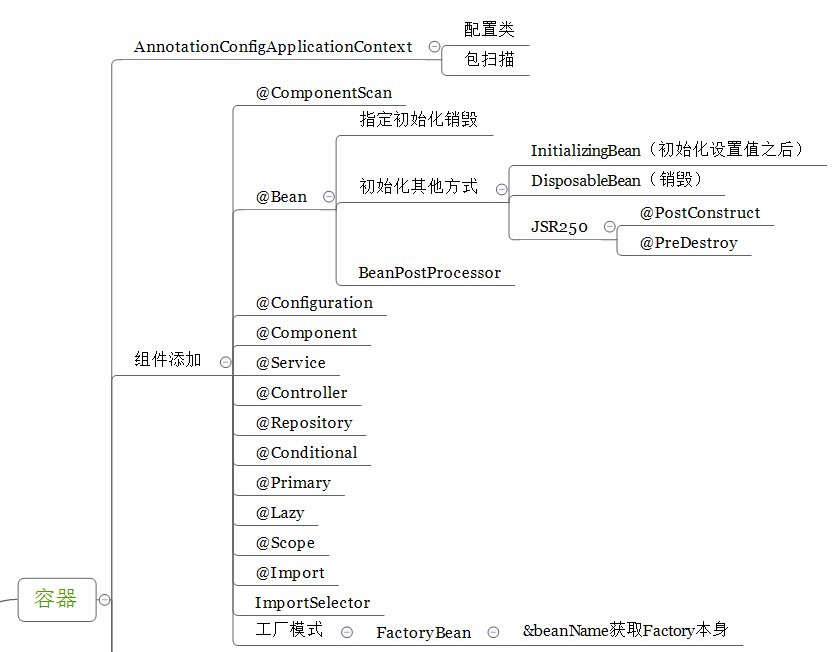
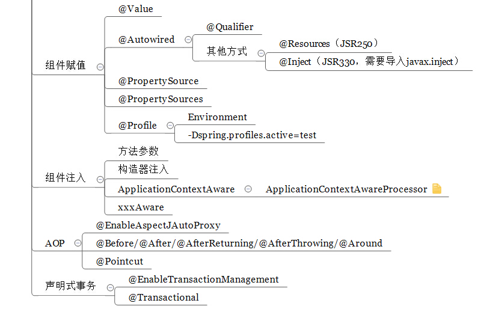
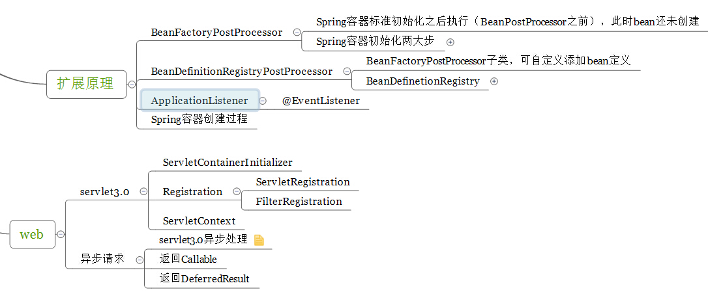

## 注解及其关联接口说明

| 注解 | 作用 | 接口 | 备注 |
| ----- | ----- | ----- |  ----- |
| @Conditional | 满足条件注入Bean | Condition接口matches方法 |  |
| @Import | 导入组件 | ImportSelector.selectImports()，ImportBeanDefinitionRegistrar.registerBeanDefinitions() |  |
| @ComponentScan | 扫描 | Filter.selectImports() |  |

 ## 核心类介绍
 
 1. DefaultListableBeanFactory
    - AliasRegistry：定义对alias的简单增删改等操作
    - SimpleAliasRegistry：主要使用map作为alias的缓存，并对接口AliasRegistry进行实现
    - SingletonBeanRegistry：定义对单例的注册及获取
    - BeanFactory：定义获取bean及bean的各种属性
    - DefaultSingletonBeanRegistry：对接口SingletonBeanRegistry各函数的实现
    - HierarchicalBeanFactory：继承BeanFactory，也就是在BeanFactory定义的功能的基础上增加了对parentFactory的支持
    - BeanDefinitionRegistry：定义对BeanDefinition的各种增删改操作
    - FactoryBeanRegistrySupport：在DefaultSingletonBeanRegistry基础上增加了对FactoryBean的特殊处理功能
    - ConfigurableBeanFactory：提供配置Factory的各种方法
    - ListableBeanFactory：根据各种条件获取bean的配置清单
    - AbstractBeanFactory：综合FactoryBeanRegistrySupport和ConfigurationBeanFactory的功能
    - AutowireCapableBeanFactory：提供创建bean、自动注入、初始化以及应用bean的后处理器
    - AbstractAutowireCapableBeanFactory：综合AbstractBeanFactory并对接口AutowireCapableBeanFactory进行实现
    - ConfigurableListableBeanFactory：BeanFactory配置清单，指定忽略类型及接口等
    - DefaultListableBeanFactory：综合上面所有功能，主要是对Bean注册后的处理
    --------------------- 
    作者：benhuo931115 
    来源：CSDN 
    原文：https://blog.csdn.net/benhuo931115/article/details/74611464 
    版权声明：本文为博主原创文章，转载请附上博文链接！
 2. XmlBeanDefinitionReader
 3. RootBeanDefinition
 4. DefaultSingletonBeanRegistry 单例Bean注册表
 5. BeanPostProcessor 后置处理器